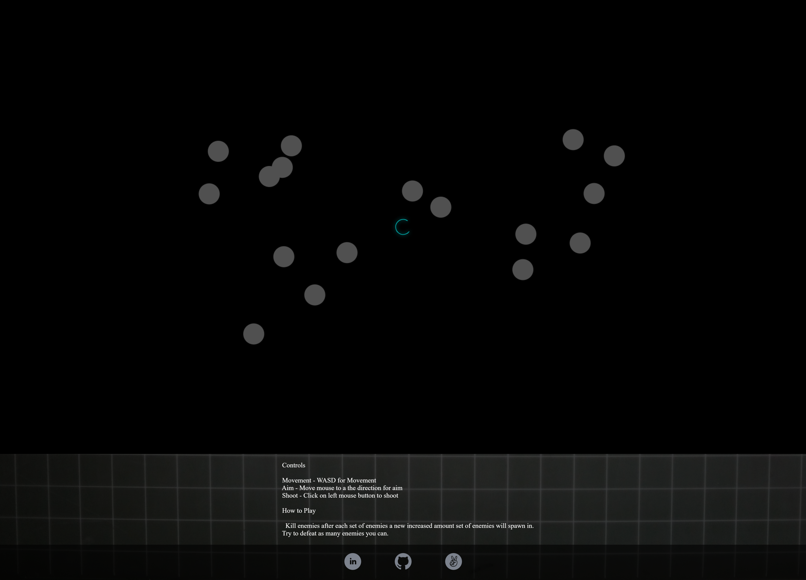
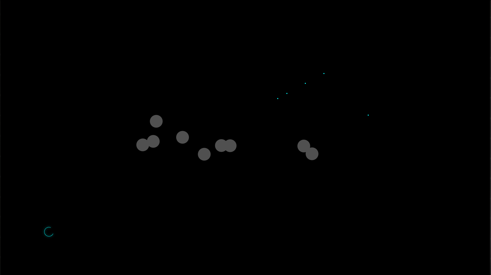
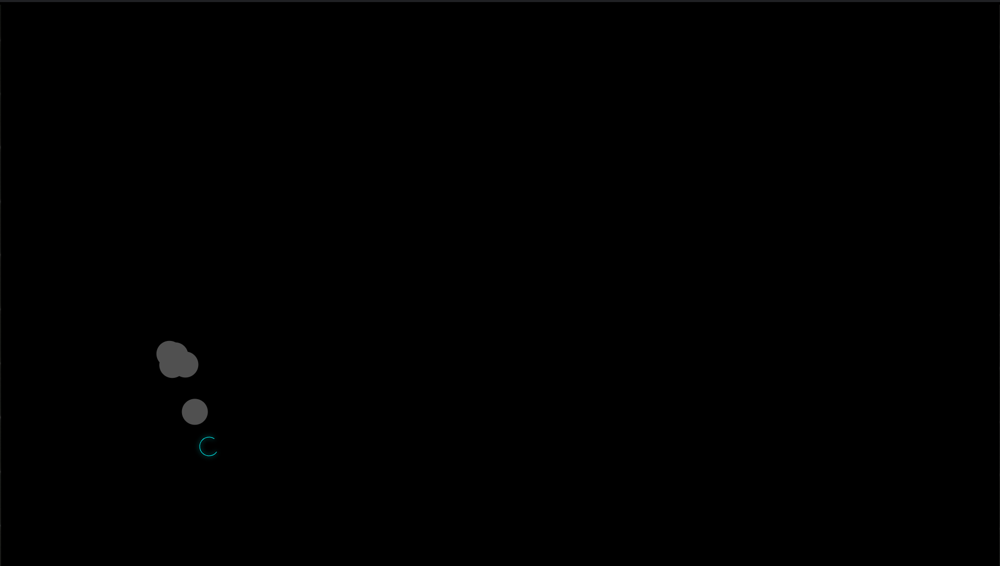
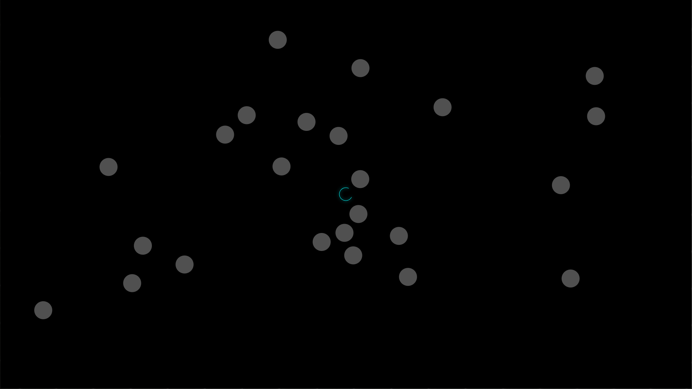

# Shape Attack



Shape Attack is a top down twin stick shooter where you control with WASD and aim and shoot with the mouse. You would take down eneimes with the mouse.

(https://gilbu.github.io/shape-attack/ "Live demo")

## Technologies

* Frontend
  * Javascript
  * Webpack

## Features

* Start Screen
* Smooth Player Movement with WASD
* Aim with Mouse Cursor
* Shoot with Mouse Click
* Enemies Chases Player
* Number of Enemies Grow


## Player Shoots



The player would be able to defeat enemies by using the cursor to aim in a direction, which would rotate the player in said direction and shoot with left click any collision with these bullets with the enemy or edge of the screen would remove the bullet and/or enemy. 

```
 if (this.movObjTyp == "Player"){
    ctx.save();
    
    
    ctx.translate(this.pos[0], this.pos[1]);
    
    ctx.rotate(this.newAngle);
    
    ctx.shadowBlur = 10;
    ctx.shadowColor = this.color;
    ctx.strokeStyle = this.color;
    ctx.beginPath();
    ctx.lineWidth = 1;
    ctx.arc(0, 0, 18, Math.PI / 4, 1.74 * Math.PI);
    ctx.stroke();
    ctx.restore();
  }
```
This code draws and rotates the player base in the angle that is passed in grabed from mouse coordinates.

## Enemies Chases Player



Enemies would chase after the player and by using WASD to control your player, you can navigate and dodge incoming enemies.

```
Enemy.prototype.move = function move(timeDelta, playerPos) {
  const newPost = Array.from(playerPos)
  newPost[0] -= this.pos[0];
  newPost[1] -= this.pos[1];
  const playerVec = Util.scale(Util.dir(newPost), DEFAULTS.SPEED);
  this.vel[0] = playerVec[0];
  this.vel[1] = playerVec[1];
  const velocityScale = timeDelta / NORMAL_FRAME_TIME_DELTA,
    offsetX = this.vel[0] * velocityScale,
    offsetY = this.vel[1] * velocityScale;
  this.pos = [this.pos[0] + offsetX, this.pos[1] + offsetY];
  if (this.game.isOutOfBounds(this.pos)) {
    if (this.isWrappable) {
      this.pos = this.game.wrap(this.pos);
    } else {
      this.remove();
    }
  }
};
```
This function will update the direction and move the enemy object base on the player current location.

## Increasing Amount of Enemies



After each wave of enemies the number of enemies would incease therefore increasing the diffculty of the game.


## Future Features

1. Add Lives
2. Add Game Over Screen
3. Add Scores